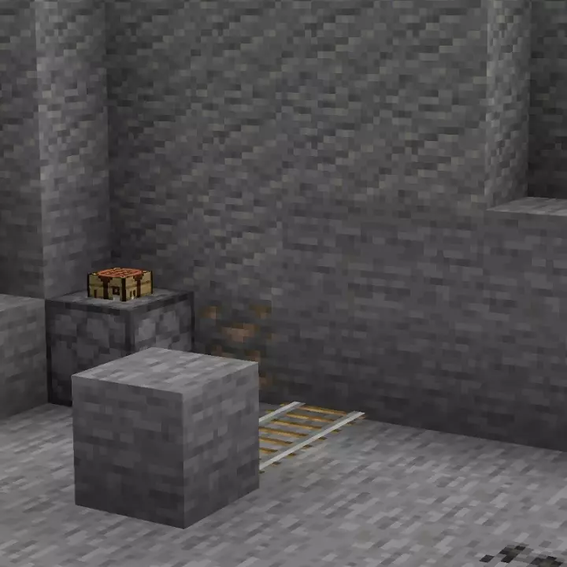

# Tunnel Bores <!--$headerTitle--><!--$pmc:delete-->

For a game with mining in its name there's distinct lack of mining machines in Minecraft! Tunnel bores introduces simple minecart-based mining machines to the game.

<!--$localAssetToURL--> <!--$modrinth:replaceWithVideo--> <!--$pmc:delete-->

### Features:
- Craft Tunnel Bores which are minecart-based mining machines!
- Tunnle Bores are fueled by coal or charcoal, just like Furnace Minecarts.
- A Chest Minecart can be attached to provide the Tunnel Bore with a stockpile of fuel and rails, the latter are placed automaticaly by the Tunnel Bore.
- Start a Tunnel Bore by right-clicking the rear of the Tunnel Bore with fuel.
